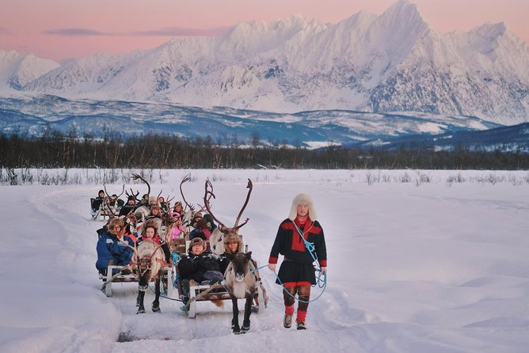

```{r setup, include = F, echo = F, warning = F, , results = 'hide', show = 'hide'}
knitr::opts_chunk$set(fig.width = 8, collapse = F, echo = F, warning = F, results = 'hide', show = 'hide')

#devtools::install_github('yihui/xaringan')
library(xaringan)
library(xaringanthemer)
#xaringan::inf_mr()
#xaringan::moon_reader
style_duo(primary_color = "#f3f6f4", secondary_color = "#121212",
                 header_font_google = google_font("Palatino Linotype", "600"),
                 text_font_google   = google_font("Palatino Linotype", "300", "300i"),
                 code_font_google   = google_font("Palatino Linotype"))


library(haven)
library(psych)
library(tidyverse)
library(dplyr)
library(ggplot2)
library(remotes)
library(kableExtra)
library(scales)
library(magick)
library(viridisLite)
library(viridis)
```

layout: false
class: left, bottom

# Nations and Nationalism


#### 02/18/2022


### Thalie Emond

---

layout: false
class: left, top

## Plan

--

#### Reccuring Themes

1. National consciousness
2. Collective Memory
3. Othering Narratives
4. Democracy & Citizenship
5. State Religion and Secularism
6. Criticism

--

#### Contemporary Issues

- Religion, Nationalism & Policy Bias
- Political Cohabitation & State Sovereignty
- Selective Amnesia & Fabricated Past

--

#### Discussion Questions

---
layout: false
class: center, middle, inverse

# Recurring Themes

---
layout: false
class: left, top

### 1. National Consciousness

--
.pull-left[
#### Gellner

- Capitalism transformation
- Industrial society 
- Reactionary nationalist movements 
- Demands for cultural homogeneity
- Proletariat & Intelligentsia efforts
]

.pull-right[


*Metropolis* (1927) by Fritz Lang]

---
### 1. National Consciousness

.pull-left[
#### Gellner

- Capitalism transformation
- Industrial society 
- Reactionary nationalist movements 
- Demands for cultural homogeneity
- Proletariat & Intelligentsia efforts


#### Bell

- Slow, gradual ideological shift
- Increased communication and mobility
- National + economic cohesion
]
 
.pull-right[


*Metropolis* (1927) by Fritz Lang]

---
.pull-left[.body2[
#### Anderson
+ Printing + Capitalism
  + Simultaneously imagined
+ Print language
  + Linguistic homogeneity
  + Loss of vernacular diversity
+ Internal pilgrimages
  + "deep, horizontal comradeship"
]]
--
.pull-right[

.center[Capybara reading about capybaras]
]
--
.pull-left[.body2[

*Metropolis* (1927) by Fritz Lang]]

---
.pull-left[.body2[
#### Anderson
+ Printing + Capitalism
  + Simultaneously imagined
+ Print language
  + Linguistic homogeneity
  + Loss of vernacular diversity
+ Internal pilgrimages
  + "deep, horizontal comradeship"
]]

.pull-right[

.center[Capybara reading about capybaras]
]

.pull-left[.body2[

.center[Unsynchronized Belgians cadets]]]


.pull-right[.body2[

British citizens reading of the King's death]]
---

.pull-left[
#### Marx
.body2[
False assumptions of **‘society-based’ arguments** 
- Shared language implies 
  + Unanimous consensus
  + Community loyalty & cohesion
- Nationalism as a **unifying force**
- Absence of institutional action
]]

---

.pull-left[.body2[
#### Marx
False assumptions of **‘society-based’ arguments** 
- Shared language implies 
  + Unanimous consensus
  + Community loyalty & cohesion
- Nationalism as a **unifying force**
- Absence of institutional action

#### Colley
- On British nationalism
  + Exclusionary and othering
  + Victimhood complex
  + Cultural superiority
  + Cultish obsession with state institutions]
]
--
.pull-right[
#### 'British-ness'
Donuts with beans... &#129326;


]

---

.pull-left[
#### Marx
.body2[
False assumptions of **‘society-based’ arguments** 
- Shared language implies 
  + Unanimous consensus
  + Community loyalty & cohesion
- Nationalism as a **unifying force**
- Absence of institutional action
]


#### Colley
.body2[
- On British nationalism
  + Exclusionary and othering
  + Victimhood complex
  + Cultural superiority
  + Cultish obsession with state institutions]

]

.pull-right[
#### 'British-ness'
Some viral tweet 


]
---

.pull-left[
#### Marx
.body2[
False assumptions of **‘society-based’ arguments** 
- Shared language implies 
  + Unanimous consensus
  + Community loyalty & cohesion
- Nationalism as a **unifying force**
- Absence of institutional action
]


#### Colley
.body2[
- On British nationalism
  + Exclusionary and othering
  + Victimhood complex
  + Cultural superiority
  + Cultish obsession with state institutions]

]

.pull-right[
#### 'British-ness'
1828 British Almanac


.center[
]
]
---
layout: false
class: left, top

### 1. National Consciousness

--

```{r}

chart2 <- chart1 <- data.frame(
  Scholar = c("Gellner", "Anderson", "Bell", "Colley", "Marx"),
  Timing = c("Long time period",
             "Simultaneously imagined, 'transverse-across-time'",
             "Ideological shift (~ century)", 
             "British nationalism: before Reformation",
             "Depends on premodern religious conflicts"),
  Sequencing = c("Industrialization precedes nationalism",
                 "Capitalism precedes nationalism",
                 "After Enlightenment",
                 "Territorial boundaries before political boundaries",
                 "Not a teleological process")) %>%
    knitr::kable(format = "html",
               col.names = c("",
                           "Timing", 
                           "Sequencing")) %>%
  kable_styling(font_size = 23) %>%
  kable_paper(html_font = "Palatino Linotype")
    
```

.center[`r chart2`]

--

#### No academic consensus on that

---
layout: false

### 2. Collective Memory

--

.pull-left[
#### Shared Heritage & Destiny
- Forging national unity (Bell, Marx)
- Collective sentiment (Marx)]

--

.pull-right[
.center[
]
]

---
layout: false

### 2. Collective Memory

.pull-left[
#### Shared Heritage & Destiny
- Forging national unity (Bell, Marx)
- Collective sentiment (Marx)]

.center[


Bell on French nationalism
]

---
### 2. Collective Memory

.pull-left[
#### Shared Heritage & Destiny
- Forging national unity (Bell, Marx)
- Collective sentiment (Marx)]

.pull-right[
#### Selective Amnesia
- Facilitates national unity or leaves open old wounds (Marx)
- National paranoia (Colley)]

.center[


Marx on nationalism
]

---
### 3. Othering Narratives

--
.pull-left[
#### Us-versus-them discourse
- Antagonism
  + Fabricated lies
  + Exaggerated claims
- Alienation]


---
### 3. Othering Narratives
.pull-left[
#### Us-versus-them discourse
- Antagonism
  + Fabricated lies
  + Exaggerated claims
- Alienation

.body2[

]]

.pull-right[
#### State-citizens relations
- Formal approach
  + Segregation, censorship
  + Visa regimes
  + Affirmative affirmation
- Informal approach
  + Patronage politics
  + Shared ethic of impartiality (Meadwell)

  
.pull-left[*The Gate of Calais* (William Hogarth, 1748) published in almanacs 
]]


---
### 4. Democracy & Citizenship

--

.pull-left[.body2[

.center[
Mass protests against the re-election of President Lukashenko in Minsk, Belarus (August 2020)
]]]


.pull-right[.body2[

.center[
Bosnian demonstrators in London, UK, raising awareness about the declining rule of law in Bosnia and Herzegovina (January 2022)]
]]

```{r }
chart4 <- data.frame(
  GellBell = c("Protests to address public grievances"),
  Marx =  c("Liberal shift from premodern times to now"),
  Colley =  c("Linked to political rights")
  ) %>%
  knitr::kable(format = "html",
               col.names = c("Gellner, Bell",
                           "Marx",
                           "Colley")) %>%
  kable_styling(font_size = 20)
```
.center[`r chart4`]

---
### 4. Democracy & Citizenship


.center[
PM Boris Johnson having a chat with the Queen
]

---

```{r}
chart3 <- data.frame(
  Diff = c("Relationship with God", "Freedom", "Legal perspective", "Legal origins"),
  Secularism =  c("More personal and direct", "of religion", "Grants legal status to religions", "Common law"),
  Laïcité =  c("Distinction between physical and spiritual realms", "from religion", "Refuses legal status to religion", "Roman law, then civil law")
  ) %>%
  knitr::kable(format = "html",
               col.names = c("",
                           "Secularism",
                           "Laïcité")) %>%
  kable_styling(font_size = 20)
  

```

### 5. State Religion and Secularism

Role of religion in **early** and **modern** nationalism in Europe (Bell, Marx, Colley)

--

`r chart3`


---
### 5. State Religion and Secularism

Role of religion in **early** and **modern** nationalism in Europe (Bell, Marx, Colley)

`r chart3`

.pull-left[
.right-column[

]]

--

.pull-right[

]

---
### 5. State Religion and Secularism

#### *Laiklik* in Turkey

.pull-left[ .body2[
Father of Republican Turkey Kemal Atatürk implemented secular laws (Kemalist doctrine) and turned Church of Hagia Sophia into a museum.]
.center[

]]

.pull-right[
.center[

]
.right[.body2[President Erdoğan held a referendum in 2020 that successfully re-established Hagia Spohia as a mosque]]]

---

### 6. Criticism (by Meadwell)
--

.pull-left[
.body2[
**Gellner's claims dismiss**

Nations as rational actors
- opting for political viability over independence

False dichotomies
- **.coral[secession]** or **.turquoise[assimilation]**
- **.coral[dominating minority]** or **.turquoise[dominated majority]**


]]
---
### 6. Criticism (by Meadwell)

.pull-left[
.body2[
**Gellner's claims dismiss**

Nations as rational actors
- opting for political viability over independence

False dichotomies
- **.coral[secession]** or **.turquoise[assimilation]**
- **.coral[dominating minority]** or **.turquoise[dominated majority]**


]
.center[.body2[
minority rule 

.pull-left[
$\neq$

independence-worthy & politically viable]

.pull-right[
$=$

inherently despotic]
]]]

--
.pull-right[ **Meadwell argues that**


> "A sense of ‘political impropriety’ is limited to the experience of being *dominated*" (Marx, 22).

]

---
### 6. Criticism (by Meadwell)

.pull-left[
.body2[
**Gellner's claims dismiss**

Nations as rational actors
- opting for political viability over independence

False dichotomies
- **.coral[secession]** or **.turquoise[assimilation]**
- **.coral[dominating minority]** or **.turquoise[dominated majority]**

]

.center[.body2[
minority rule 

.pull-left[
$\neq$

independence-worthy & politically viable]

.pull-right[
$=$

inherently despotic]
]]]


.pull-right[.body2[ **Meadwell argues that**

> "A sense of ‘political impropriety’ is limited to the experience of being *dominated*" (22).


- Trust-based cohabitation
  + impartiality > legitimacy
- Consent is important
- Political impropriety goes both ways

.left[ 
>“Nationalism does not generate its own standards of normative judgment” (29) 
]

Gellner and Anderson ground their arguments in **modernist** theory, yet differ greatly from one another
]]

---
layout: false
class: inverse, middle, center

# Contemporary Issues

---

### 2.1 Legacy of Religion on Nationalism 
#### Differences in policy regimes?

--
.left-column[.body2[.center[
**.coral[Accommodation]** versus **.turquoise[Assimilation]**
]

- Welfare state
- Education
- Immigration system

.center[ 
**.coral[Inclusive]** versus **.turquoise[Exclusionary]**
]
]]

--

.center[
]

---
### 2.2 Political Cohabitation & Sovereignty

--
**Sami Peoples of Norway, Sweden, and Finland**
.pull-left[.body2[

.center[Sami family sledding in Tromso, Norway]]]


.pull-right[.body2[

.center[Sami childern at reindeer kindergarten in Karasjok, Norway]
]]
--


In recent years, Norway, Sweden, and Finland each have launched a **truth commission**, which is a mechanism of transitional justice that aims to redress "large-scale or systematic human rights violations" (*ICTJ*).

---
### 2.2 Political Cohabitation & Sovereignty


**Sami Peoples of Norway, Sweden, and Finland**
.center[
]


Their respective TCs are based on Canada's Truth and Reconciliation Commission (foster **nation-to-nation relationship**) rather than Denmark's Greenlandic Reconciliation Commission (**recognition-based** + welfare policies)

---
### 2.3 Selective Amnesia

--
#### Failure of multiculturalism in (West) Europe

.pull-left[
]

.pull-right[
]

--

>“Those who cannot remember the past are condemned to repeat it”
- George Santanaya


---

#### References

.body2[
- https://media.giphy.com/media/3o7absMfvwKhHkFFv2/giphy.gif
- https://media.giphy.com/media/L2Tnlhaiw5PQqpnlCz/giphy-downsized-large.gif
- https://www.sadanduseless.com/wp-content/uploads/2018/12/reading-newspapers5.jpg
- https://twitter.com/krispykremeUK/status/1491358975123763202
- https://commons.wikimedia.org/wiki/File:British_Almanac_1828.jpg
- https://twitter.com/SumzIbrahiim/status/1327190276495060993
- https://www.facebook.com/YUGNATMEME/photos/a.154934748530441/161543324536250- https://www.axios.com/belarus-protests-lukashenko-ed7ef182-d634-4552-812f-1f4490b9b928.html
- https://www.nzherald.co.nz/world/mass-global-protests-held-as-bosnia-herzegovina-teeters-on-brink-of-collapse/JP56ZZ5YFCOABH65FYI6UKEZMA/
- https://commons.wikimedia.org/wiki/File:Mustafa_Kemal_Atat%C3%BCrk_(1918).jpg
- https://www.asianews.it/news-en/Erdogan-is-preparing-to-pray-in-the-Hagia-Sophia-next-Friday-40413.html
- https://www.viator.com/en-CA/tours/Tromso/Reindeer-sledding-and-sami-culture/d4362-38766P1
]
---

#### References
.body2[
- https://www.cbc.ca/news/indigenous/indigenous-sami-people-of-europe-celebrate-their-national-day-centenary-1.3968999
- https://www.justiceinfo.net/en/43949-lessons-from-the-greenlandic-reconciliation-process.html
- https://www.ons.gov.uk/peoplepopulationandcommunity/populationandmigration/internationalmigration/datasets/populationoftheunitedkingdombycountryofbirthandnationality
- https://www.theguardian.com/world/2010/oct/17/angela-merkel-german-multiculturalism-failed
]
---
layout: false
class: inverse, middle, left

# Discussion


.right-column[.pull-left[]

.pull-right[
]]

---
### 3. Questions
**1. Does previous state (or dominant) religion have an significant impact on the formation or conceptualization of a national community?**
  + ex. on social attitudes, state policy, political rights
  
**2. Is political cohabitation possible? If so, how should state sovereignty be dealt with in multicultural states?**
  + ex. Sami peoples (Nordic countries), Inuit peoples (Denmark)

.pull-left[.body2[
**3. How to reconcile with a  violent past? Is myth-making really an effective nation-building tool?**
  + ex. anti-semitism in Romania, Serbian-Bosnian frictions in Kosovo  
  + Are shared life experiences under difficult times what truly shape national identity?]]
.pull-right[
.footnote[

]]


